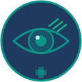

<p align="center">
  
</p>

<h1 align="center">OftalmoClaw</h1>

<p align="center">
  <strong>Mission Control de Oftalmologia com IA</strong>
  <br />
  <em>Agente inteligente para análise de imagens, suporte à decisão clínica e diagnóstico colaborativo</em>
</p>

<p align="center">
  <a href="#o-que-é">O que é</a> &bull;
  <a href="#guia-rápido-para-médicos">Guia para Médicos</a> &bull;
  <a href="#usando-com-claude-code">Claude Code</a> &bull;
  <a href="#instalação-técnica">Instalação</a> &bull;
  <a href="#segunda-opinião">Segunda Opinião</a> &bull;
  <a href="#dashboard-de-tendências">Tendências</a> &bull;
  <a href="#api">API</a> &bull;
  <a href="#contribuindo">Contribuir</a>
</p>

<p align="center">
  
  
  
  
</p>

<p align="center">
  <a href="https://www.instagram.com/geekvisionbr/"></a>
</p>

---

## O que é

**OftalmoClaw** é um sistema open-source que funciona como um assistente de IA especializado em oftalmologia. Ele combina:

- **Análise de imagens** (OCT, fundoscopia, topografia, campimetria)
- **Segunda opinião** entre especialistas em tempo real
- **Dashboard de tendências** com volume de exames, qualidade e rankings
- **Calculadoras clínicas** (LIO, acuidade visual, PIO corrigida)
- **Gerador de laudos** com terminologia padrão

Pense nele como um "painel de controle" para sua clínica ou consultório, com IA embutida.

### O que NÃO é

- **Não é um dispositivo médico** — não tem registro ANVISA/FDA
- **Não substitui o médico** — toda análise precisa de validação por oftalmologista
- **Não armazena prontuário** — é um sistema de apoio, não um PEP/EMR

### Relação com o Hermes Agent

O OftalmoClaw foi construído com base na arquitetura do [Hermes Agent](https://github.com/NousResearch/hermes-agent), um projeto open-source da Nous Research. Aproveitamos:

| Do Hermes Agent | No OftalmoClaw |
|-----------------|----------------|
| Sistema de skills (conhecimento em Markdown) | Skills específicas de oftalmologia |
| Registry de tools (ferramentas do agente) | Tools de análise de imagem, laudos, calculadoras |
| Gateway de mensagens (Telegram, WhatsApp) | Notificações de casos para médicos |
| Memória persistente entre sessões | Histórico de casos e padrões clínicos |

**Você NÃO precisa instalar o Hermes Agent separadamente.** O OftalmoClaw é um projeto independente que já inclui tudo que precisa.

---

## Guia Rápido para Médicos

> Se você nunca mexeu com programação, este guia é para você.

### O que você vai precisar

| Item | O que é | Como conseguir |
|------|---------|----------------|
| **Computador** | Mac, Windows ou Linux | O que você já usa |
| **Chave de IA** | Uma "senha" que permite ao sistema usar inteligência artificial | Veja o Passo 1 abaixo |
| **Railway** (opcional) | Um serviço na nuvem que roda o sistema 24h | Veja o Passo 2, opção A |

### Passo 1: Obter sua chave de IA

O OftalmoClaw precisa de uma chave de API para acessar modelos de inteligência artificial. Você tem três opções — escolha **uma**:

#### Opção A: OpenRouter (mais fácil — acesso a vários modelos num só lugar)

O OpenRouter é um "agregador" que dá acesso ao Claude, ChatGPT, Gemini e outros modelos com uma única chave.

1. Acesse [openrouter.ai](https://openrouter.ai)
2. Clique em **"Sign Up"** e crie uma conta (pode usar Google)
3. Vá em **"Keys"** no menu lateral
4. Clique em **"Create Key"**
5. Copie a chave que começa com `sk-or-...`
6. Adicione créditos: vá em **"Credits"** e adicione $5 (rende ~500 consultas simples)

> **Dica:** com o OpenRouter você pode trocar entre Claude, ChatGPT e outros modelos sem precisar de múltiplas contas.

#### Opção B: Anthropic direto (melhor qualidade com Claude)

O Claude, da Anthropic, é o modelo com melhor desempenho em raciocínio clínico e análise de imagens médicas.

1. Acesse [console.anthropic.com](https://console.anthropic.com)
2. Crie uma conta
3. Vá em **"API Keys"**
4. Clique em **"Create Key"**
5. Copie a chave que começa com `sk-ant-...`
6. Adicione créditos em **"Billing"** (mínimo $5)

#### Opção C: OpenAI (ChatGPT)

Se você já usa o ChatGPT e prefere continuar com ele:

1. Acesse [platform.openai.com](https://platform.openai.com)
2. Crie uma conta ou faça login com sua conta do ChatGPT
3. Vá em **"API Keys"** (menu lateral esquerdo)
4. Clique em **"Create new secret key"**
5. Copie a chave que começa com `sk-...`
6. Adicione créditos em **"Billing"** > **"Add payment method"** (mínimo $5)

> **Importante:** a chave de API é diferente da sua assinatura do ChatGPT Plus. Mesmo com o Plus, você precisa adicionar créditos de API separadamente.

#### Quanto custa?

| Uso | Custo estimado/mês |
|-----|--------------------|
| Consultas de texto simples (perguntas clínicas) | ~$2–5 |
| Análise de imagens (OCT, fundoscopia) | ~$5–15 |
| Uso intensivo (clínica com vários médicos) | ~$20–50 |

> Os modelos de IA cobram por "tokens" (palavras processadas). Imagens custam mais que texto. Você pode acompanhar seus gastos no painel do provedor escolhido (OpenRouter, Anthropic ou OpenAI).

#### Qual modelo escolher?

| Modelo | Provedor | Melhor para | Preço relativo |
|--------|----------|-------------|----------------|
| **Claude Sonnet** | Anthropic / OpenRouter | Análise clínica, imagens, raciocínio longo | Médio |
| **Claude Opus** | Anthropic / OpenRouter | Casos complexos, segunda opinião assistida | Alto |
| **GPT-4o** | OpenAI / OpenRouter | Uso geral, perguntas rápidas | Médio |
| **GPT-4o mini** | OpenAI / OpenRouter | Tarefas simples, alto volume, baixo custo | Baixo |
| **Gemini Pro** | OpenRouter | Alternativa gratuita para testes | Grátis (limitado) |

---

### Passo 2: Rodar o sistema

Você tem três caminhos. Escolha o que faz mais sentido para você:

#### Opção A: Na nuvem com Railway (sem instalar nada, acesso de qualquer lugar)

O Railway é um serviço de hospedagem na nuvem. Você sobe o sistema lá e acessa de qualquer computador ou celular pelo navegador.

1. Crie uma conta grátis em [railway.app](https://railway.app) (pode usar GitHub ou Google)
2. Clique em **"New Project"** > **"Deploy from GitHub repo"**
3. Conecte este repositório
4. Em **"Variables"**, adicione:
   - `OPENROUTER_API_KEY` = sua chave do Passo 1 (ou `ANTHROPIC_API_KEY` ou `OPENAI_API_KEY`, dependendo da opção escolhida)
   - `SECRET_KEY` = qualquer frase longa (ex: `minha-clinica-oftalmologia-2024`)
5. Clique em **"Deploy"**
6. Em ~2 minutos você terá uma URL como `oftalmo-claw-production.up.railway.app`
7. Abra essa URL no navegador — pronto!

**Custo do Railway:** plano Starter é gratuito para testes. Plano Pro custa $5/mês para uso contínuo.

#### Opção B: No seu computador — offline com localhost (mais privado, custo zero de servidor)

Nesta opção, o sistema roda inteiramente na sua máquina. Os dados ficam num banco de dados local (SQLite — um arquivo simples no seu computador). Não precisa de internet para acessar o painel, apenas para consultar a IA.

**Pré-requisito:** instalar o Python 3.11 ou superior.
- **Mac:** baixe em [python.org](https://python.org) ou abra o Terminal e digite `brew install python`
- **Windows:** baixe em [python.org](https://python.org) e na instalação **marque a caixa "Add Python to PATH"**

Depois, abra o **Terminal** (Mac/Linux) ou **Prompt de Comando** (Windows) e execute:

```bash
# 1. Baixe o projeto
git clone https://github.com/geekvision/oftalmo-claw.git
cd oftalmo-claw

# 2. Crie um ambiente isolado para o projeto
python -m venv .venv

# 3. Ative o ambiente
source .venv/bin/activate          # Mac / Linux
# .venv\Scripts\activate           # Windows

# 4. Instale as dependências
pip install -r requirements.txt

# 5. Crie seu arquivo de configuração
cp .env.example .env
```

Agora abra o arquivo `.env` com qualquer editor de texto (TextEdit, Bloco de Notas, VS Code) e cole sua chave de IA na linha correspondente:

```
# Se você escolheu OpenRouter:
OPENROUTER_API_KEY=sk-or-cole-sua-chave-aqui

# Se você escolheu Anthropic (Claude):
ANTHROPIC_API_KEY=sk-ant-cole-sua-chave-aqui

# Se você escolheu OpenAI (ChatGPT):
OPENAI_API_KEY=sk-cole-sua-chave-aqui
```

Salve o arquivo e inicie o sistema:

```bash
python main.py
```

Você verá algo como:

```
  OftalmoClaw v0.1.0
  by GeekVision
  Mission Control: http://0.0.0.0:8000
```

Abra o navegador e acesse **http://localhost:8000** — o Mission Control estará rodando.

**Como funciona nesta opção:**
- O banco de dados é um arquivo SQLite em `data/oftalmo_claw.db` — não precisa instalar nada extra
- Os dados ficam apenas no seu computador (privacidade total)
- O sistema roda enquanto o Terminal estiver aberto
- Para parar, pressione `Ctrl+C` no Terminal
- Para iniciar novamente, basta repetir os passos 3 e o `python main.py`

#### Opção C: Com Docker (para quem já conhece containers)

```bash
docker build -t oftalmo-claw .

docker run -d \
  --name oftalmo-claw \
  -p 8000:8000 \
  -e OPENROUTER_API_KEY=sk-or-sua-chave \
  -e SECRET_KEY=sua-frase-secreta \
  -v oftalmo-data:/app/data \
  oftalmo-claw
```

Acesse `http://localhost:8000`.

---

### O que você vai ver

Ao abrir o sistema pela primeira vez, um banner de boas-vindas explica o que cada seção faz. Você terá acesso a:

**Mission Control (página principal)**
- Banner de boas-vindas na primeira visita (some depois)
- 4 cards guiados: "Perguntar à IA", "Pedir Segunda Opinião", "Calculadoras", "Tendências"
- Resumo do dia colapsável: exames, casos pendentes, especialistas online
- Busca global na topbar (caso, paciente, médico)
- Notificações com badge de casos pendentes
- Perfil do usuário com menu dropdown

**Segunda Opinião**
- Formulário completo para criar novo caso (modal com 10 campos)
- Lista de casos com cards clicáveis → abre modal de detalhe
- Timeline visual com opiniões e discussão
- Painel de especialistas com status online/offline
- Card de dicas para primeiro uso

**Chat com IA**
- 5 sugestões rápidas clicáveis (chips) para começar sem digitar
- Renderização de markdown nas respostas (bold, code, listas)
- Timestamps em cada mensagem
- Suporte a OpenRouter, Anthropic e OpenAI

**Calculadoras Clínicas**
- LIO (SRK/T): com validação de range clínico
- Conversor de acuidade visual: Snellen ↔ Decimal ↔ LogMAR
- Correção de PIO por paquimetria (Ehlers)
- Botão "Imprimir resultado" com layout otimizado
- Tabela de referência rápida

**Dashboard de Tendências**
- Volume de exames por mês com gráfico de barras
- Score de qualidade por tipo de exame
- Ranking de operadores com medalhas
- Dados carregados em tempo real da API

---

<h2 id="usando-com-claude-code">Usando com Claude Code</h2>

Se você já usa o **Claude Code** (a ferramenta de linha de comando da Anthropic), pode integrá-lo diretamente com o OftalmoClaw para desenvolver, personalizar e operar o sistema.

### O que é o Claude Code?

O Claude Code é um assistente de programação que roda no seu terminal. Você conversa com ele em português e ele edita código, roda comandos e resolve problemas. É como ter um programador assistente 24h.

### Como usar juntos

```bash
# 1. Abra o terminal na pasta do projeto
cd oftalmo-claw

# 2. Inicie o Claude Code
claude

# 3. Agora você pode pedir coisas como:

> "Adicione um novo tipo de exame chamado Paquimetria no dashboard de tendências"

> "Crie uma skill de farmacologia com os colírios mais usados em glaucoma"

> "Configure o gateway do Telegram para eu receber notificações de novos casos"

> "Adicione um campo de CID-10 no formulário de segunda opinião"

> "Mude a cor do cabeçalho para azul mais escuro"
```

### Fluxo recomendado

```
Você (médico) descreve o que quer em português
        |
Claude Code entende e edita o código
        |
Você testa no navegador (localhost:8000)
        |
Gostou? Peça para o Claude fazer deploy no Railway
        |
Não gostou? Descreva o ajuste e ele corrige
```

### Dicas para médicos usando Claude Code

- **Seja específico**: em vez de "melhore o sistema", diga "adicione um campo de pressão intraocular no caso de segunda opinião"
- **Descreva como médico**: use termos clínicos naturalmente — "quero classificar por ETDRS", "incluir escala de Shaffer"
- **Peça screenshots**: diga "abra o navegador e me mostre como ficou"
- **Salve versões**: diga "faça um commit com essas mudanças" para não perder trabalho

### Arquivo CLAUDE.md

O projeto inclui um arquivo `CLAUDE.md` na raiz que dá contexto ao Claude Code sobre o projeto. Isso faz com que ele entenda automaticamente:

- A estrutura de pastas e arquivos
- O padrão de skills (Markdown com frontmatter YAML)
- O padrão de tools (registro no registry.py)
- O tema de cores médicas
- As convenções do projeto

---

## Funcionalidades

### Hoje (implementado)

| Funcionalidade | Status | Descrição |
|---------------|--------|-----------|
| Mission Control | ✅ Pronto | Dashboard com boas-vindas, cards guiados, stats colapsáveis |
| Segunda Opinião | ✅ Pronto | Formulário completo, modal de detalhe com timeline, busca |
| Chat com IA | ✅ Pronto | Sugestões rápidas, markdown, timestamps, multi-provedor |
| Calculadoras Clínicas | ✅ Pronto | LIO (SRK/T), conversor AV, correção PIO — com validação e print |
| Dashboard Tendências | ✅ Pronto | Volume, qualidade, rankings — dados reais do banco |
| Banco de dados real | ✅ Pronto | SQLite (local) / PostgreSQL (Railway) com seed de dados demo |
| API REST | ✅ Pronto | 15+ endpoints para cases, analytics, chat, calculadoras |
| PWA | ✅ Pronto | Instalável em tablet/celular, ícones, manifest.json |
| Toast Notifications | ✅ Pronto | Feedback visual em todas as ações (sucesso/erro/aviso) |
| Busca Global | ✅ Pronto | Busca por caso, paciente, médico na topbar |
| Topbar Profissional | ✅ Pronto | Perfil do usuário, notificações com badge, busca |
| Mobile Responsivo | ✅ Pronto | Menu hamburger, sidebar overlay, layout adaptável |
| Impressão | ✅ Pronto | Botão imprimir nas calculadoras com layout otimizado |
| Skills Oftalmológicas | 🔄 Parcial | Core e Imaging completos, outros em andamento |
| Deploy Railway | ✅ Pronto | Dockerfile + railway.json configurados |
| Modo offline | ✅ Pronto | Roda local com SQLite, sem precisar de servidor |

### Em desenvolvimento

| Funcionalidade | Prioridade | Descrição |
|---------------|-----------|-----------|
| Análise de imagens com IA | Alta | Upload + interpretação de OCT, fundoscopia |
| Autenticação real | Média | Login com CRM, sessões, permissões |
| Notificações WhatsApp | Média | Alertas de novos casos via WhatsApp |
| Gerador de laudos | Média | Templates por tipo de exame |
| Protocolos clínicos | Média | Fluxogramas AAO, CBO, EURETINA |
| Skills cirúrgica + farmaco | Média | Facoemulsificação, anti-VEGF, colírios |
| DICOM | Baixa | Leitura de arquivos de equipamentos |
| LGPD | Baixa | Anonimização, consentimento, audit trail |

> **Documentação completa:** veja [docs/FUNCIONALIDADES.md](docs/FUNCIONALIDADES.md) para detalhes de cada feature e [CHANGELOG.md](CHANGELOG.md) para o histórico de melhorias.

---

<h2 id="segunda-opinião">Sistema de Segunda Opinião</h2>

Permite que médicos enviem casos clínicos para consulta com outros especialistas.

### Fluxo

```
Médico A envia caso (imagens + história clínica)
        |
Sistema identifica especialistas disponíveis
        |
IA gera rascunho de análise (opcional)
        |
Especialista B revisa e emite parecer
        |
Thread de discussão entre os médicos
        |
Caso encerrado com consenso final
```

### Dados do caso

- **Paciente**: idade, sexo, histórico relevante (anonimizado)
- **Queixa principal**: descrição do problema
- **Exames**: imagens anexadas (OCT, retinografia, campo visual, etc.)
- **Hipótese diagnóstica**: o que o médico solicitante suspeita
- **Urgência**: Normal, Urgente (24h), Emergência (imediato)
- **Especialidade**: Retina, Glaucoma, Córnea, Refrativa, Oculoplástica, Estrabismo, Neuro-oftalmo, Uveíte

### Especialidades e roteamento

| Especialidade | Quando encaminhar |
|--------------|-------------------|
| **Retina** | DMRI, retinopatia diabética, RVO, descolamento, maculopatia |
| **Glaucoma** | PIO elevada, dano no nervo óptico, perda de campo visual |
| **Córnea** | Ceratocone, infecções, ectasia, transplante |
| **Refrativa** | Candidatura LASIK/PRK, ICL, surpresa refrativa |
| **Oculoplástica** | Pálpebras, vias lacrimais, órbita |
| **Estrabismo** | Desalinhamento, diplopia |
| **Neuro-oftalmo** | Neurite óptica, papiledema, paralisia de nervos cranianos |
| **Uveíte** | Inflamação intraocular, doenças autoimunes |

---

<h2 id="dashboard-de-tendências">Dashboard de Tendências</h2>

Visão macro do desempenho da clínica/serviço.

### Métricas disponíveis

- **Volume por período** — Quantidade de exames por semana/mês/trimestre/ano
- **Score de qualidade** — Média por tipo de exame e por operador
- **Performance por tipo de exame** — Fundoscopia, OCT, Campimetria, Topografia, Biometria
- **Ranking de operadores** — Médicos ordenados por volume e qualidade
- **Usuários ativos** — Quantos médicos estão usando o sistema
- **Segunda opinião** — Casos pendentes, resolvidos, tempo médio de resposta
- **Tempo de laudo** — Média entre exame e assinatura do laudo

### Consulta por chat (com IA conectada)

Quando o agente de IA estiver configurado, você poderá perguntar em linguagem natural:

```
"Quantos OCTs fizemos este mês?"
"Quem é o operador com melhor score de qualidade?"
"Qual a tendência de fundoscopias no último trimestre?"
"Exporta o relatório mensal em CSV"
```

---

## API

O sistema expõe uma API REST para integração com outros sistemas (prontuário, equipamentos, apps).

### Endpoints principais

| Método | Endpoint | Descrição |
|--------|----------|-----------|
| `GET` | `/health` | Verifica se o sistema está rodando |
| `POST` | `/api/v1/chat` | Envia mensagem para o agente de IA |
| `GET` | `/api/v1/cases` | Lista casos de segunda opinião |
| `POST` | `/api/v1/cases` | Cria novo caso |
| `GET` | `/api/v1/cases/:id` | Detalhes completos (opiniões, mensagens, imagens) |
| `POST` | `/api/v1/cases/:id/opinions` | Envia parecer sobre um caso |
| `POST` | `/api/v1/cases/:id/messages` | Envia mensagem na discussão do caso |
| `PATCH` | `/api/v1/cases/:id/status` | Atualiza status do caso |
| `GET` | `/api/v1/cases/specialists` | Lista especialistas com casos ativos |
| `GET` | `/api/v1/dashboard/stats` | Stats do Mission Control (tempo real) |
| `GET` | `/api/v1/analytics/trends` | Tendências de volume e qualidade |
| `GET` | `/api/v1/analytics/by-exam-type` | Performance por tipo de exame |
| `GET` | `/api/v1/analytics/rankings` | Ranking de operadores |
| `GET` | `/api/v1/analytics/summary` | Resumo geral do sistema |
| `GET` | `/api/v1/calculators/iol` | Cálculo de LIO (SRK/T) |
| `GET` | `/api/v1/calculators/va-convert` | Conversão de acuidade visual |

### Exemplo: Calcular LIO

```
GET /api/v1/calculators/iol?al=23.5&k1=43.0&k2=44.0&target=-0.5

Resposta:
{
  "result": {
    "iol_power": 20.55,
    "formula": "SRK/T (simplified)",
    "disclaimer": "Apenas para fins educacionais."
  }
}
```

### Exemplo: Converter acuidade visual

```
GET /api/v1/calculators/va-convert?snellen=20/40

Resposta:
{
  "snellen": "20/40",
  "decimal": 0.5,
  "logmar": 0.3,
  "category": "Perda visual leve"
}
```

---

<h2 id="instalação-técnica">Instalação Técnica (para desenvolvedores)</h2>

### Pré-requisitos

- Python 3.11+
- Git
- Uma chave de API (OpenRouter, Anthropic ou OpenAI)

### Setup completo

```bash
# Clonar
git clone https://github.com/geekvision/oftalmo-claw.git
cd oftalmo-claw

# Ambiente virtual
python -m venv .venv
source .venv/bin/activate

# Dependências
pip install -r requirements.txt

# Configurar
cp .env.example .env
# Edite .env com suas chaves

# Rodar
python main.py
```

### Modos de execução

```bash
python main.py                  # Web (Mission Control) — padrão
python main.py --mode cli       # Agente por linha de comando
python main.py --mode gateway   # Gateway de mensagens (Telegram, WhatsApp)
python main.py --setup          # Assistente de configuração
```

### Deploy no Railway

1. Faça fork deste repositório no GitHub
2. Crie conta em [railway.app](https://railway.app)
3. New Project > Deploy from GitHub repo
4. Adicione as variáveis de ambiente:

| Variável | Obrigatória | Descrição |
|----------|-------------|-----------|
| `OPENROUTER_API_KEY` | Sim* | Chave do OpenRouter para acesso à IA |
| `ANTHROPIC_API_KEY` | Sim* | Chave da Anthropic — alternativa ao OpenRouter |
| `OPENAI_API_KEY` | Sim* | Chave da OpenAI (ChatGPT) — alternativa ao OpenRouter |
| `SECRET_KEY` | Sim | Frase secreta para criptografia de sessão |
| `DATABASE_URL` | Não | URL do PostgreSQL (Railway provisiona automaticamente) |
| `PORT` | Não | Porta do servidor (padrão: 8000) |
| `TELEGRAM_TOKEN` | Não | Token do bot Telegram para notificações |
| `WHATSAPP_TOKEN` | Não | Token WhatsApp Cloud API |
| `LOG_LEVEL` | Não | Nível de log: INFO, DEBUG, WARNING |

> \* Você precisa de **pelo menos uma** chave de IA. Escolha a do provedor que preferir.

5. Deploy automático via Dockerfile incluído.

### Estrutura do projeto

```
oftalmo-claw/
├── main.py                     # Ponto de entrada
├── config.py                   # Configurações (.env)
├── requirements.txt            # Dependências Python
│
├── web/                        # Mission Control (interface web)
│   ├── app.py                  # Aplicação FastAPI
│   ├── routes/                 # Rotas da API
│   │   ├── dashboard.py        # Stats do painel principal
│   │   ├── cases.py            # CRUD de casos (segunda opinião)
│   │   ├── analytics.py        # Tendências e rankings
│   │   └── api.py              # Chat, calculadoras
│   ├── templates/              # Páginas HTML
│   │   ├── base.html           # Layout (sidebar, topbar, toast, PWA)
│   │   ├── dashboard.html      # Mission Control (boas-vindas, cards)
│   │   ├── second_opinion.html # Segunda Opinião (form, detalhe, timeline)
│   │   ├── trends.html         # Dashboard de Tendências
│   │   ├── calculators.html    # Calculadoras (LIO, AV, PIO)
│   │   ├── chat.html           # Chat com IA (sugestões, markdown)
│   │   └── login.html          # Tela de login
│   └── static/
│       ├── css/theme.css       # Tema médico (~1150 linhas: modal, toast, skeleton, etc.)
│       ├── js/app.js           # Interações (~230 linhas: toast, search, modal, markdown)
│       ├── manifest.json       # PWA manifest (instalável)
│       └── images/             # Favicon SVG + ícones PWA (192px, 512px)
│
├── agent/                      # Agente de IA
│   └── core.py                 # Loop principal do agente
│
├── tools/                      # Ferramentas do agente
│   └── registry.py             # Registro central de tools
│
├── skills/                     # Conhecimento (Markdown)
│   └── ophthalmology/
│       ├── core/SKILL.md       # Anatomia, patologias, CID-10
│       ├── imaging/SKILL.md    # OCT, fundoscopia, campo visual
│       ├── second-opinion/     # Protocolo de consulta
│       └── analytics/          # Queries de analytics
│
├── models/                     # Modelos do banco de dados
│   ├── database.py             # Conexão SQLAlchemy
│   ├── case.py                 # Caso, Opinião, Mensagem, Imagem
│   ├── doctor.py               # Médico / Especialista
│   └── exam.py                 # Registro de exame, snapshots
│
├── gateway/                    # Integrações de mensagem
│   └── platforms/              # Telegram, WhatsApp, etc.
│
├── Dockerfile                  # Container para deploy
├── railway.json                # Config Railway
├── Procfile                    # Processos (web + worker)
└── .env.example                # Exemplo de configuração
```

### Skills: como funcionam

Skills são arquivos Markdown que dão conhecimento especializado ao agente. Ficam em `skills/ophthalmology/` e seguem o padrão [agentskills.io](https://agentskills.io):

```markdown
---
name: minha-skill
description: O que esta skill ensina ao agente
version: 1.0.0
author: Seu Nome
license: MIT
metadata:
  hermes:
    tags: [ophthalmology, minha-area]
    category: ophthalmology
---

# Título

Conteúdo que o agente vai "saber"...
```

**Skills incluídas:**

| Skill | Conteúdo |
|-------|----------|
| `core` | Anatomia ocular, patologias, CID-10, classificações (Shaffer, LOCS III, AREDS) |
| `imaging` | Interpretação de OCT, fundoscopia, campimetria, topografia, biometria |
| `second-opinion` | Protocolo de consulta colaborativa, checklist, roteamento |
| `analytics` | Queries em linguagem natural para o dashboard |

**Para criar uma nova skill:** crie uma pasta em `skills/ophthalmology/` com um arquivo `SKILL.md` seguindo o formato acima.

---

## Contribuindo

Aceitamos contribuições de oftalmologistas, desenvolvedores e pesquisadores.

### Como contribuir

1. Faça **Fork** do repositório
2. Crie uma branch: `git checkout -b feature/minha-feature`
3. Faça suas alterações e commit: `git commit -m 'Adiciona minha feature'`
4. Push: `git push origin feature/minha-feature`
5. Abra um **Pull Request**

### Áreas de contribuição

| Área | Perfil | Impacto |
|------|--------|---------|
| **Skills clínicas** | Oftalmologista | Alto — melhora diretamente o conhecimento da IA |
| **Protocolos** | Oftalmologista | Alto — guidelines baseados em evidência |
| **Tools/API** | Desenvolvedor Python | Alto — novas funcionalidades |
| **Frontend** | Desenvolvedor Web | Médio — melhorias na interface |
| **Testes** | Desenvolvedor | Médio — estabilidade |
| **Traduções** | Qualquer | Baixo — acessibilidade |

### Para oftalmologistas sem experiência em código

Você pode contribuir sem programar:

1. **Abra uma Issue** descrevendo uma funcionalidade que faria diferença na sua prática
2. **Revise as skills** — leia os arquivos em `skills/ophthalmology/` e sugira correções ou adições
3. **Teste o sistema** e reporte bugs ou sugestões de melhoria
4. **Compartilhe protocolos** que poderiam ser incluídos como skills

---

## Aviso Médico

> **OftalmoClaw NÃO é um dispositivo médico.** Destina-se exclusivamente à pesquisa, educação e suporte à decisão clínica. NÃO deve ser usado como substituto do julgamento médico profissional. Todos os diagnósticos e decisões de tratamento devem ser feitos por profissionais de saúde qualificados. As análises e sugestões geradas por IA requerem revisão e validação obrigatória por oftalmologista habilitado antes de qualquer ação clínica.

---

## Licença

MIT License — veja [LICENSE](LICENSE) para detalhes.

**Atribuição obrigatória:** qualquer projeto que use o OftalmoClaw deve incluir:

> Built with OftalmoClaw by GeekVision

---

## Agradecimentos

- **[Hermes Agent](https://github.com/NousResearch/hermes-agent)** da Nous Research — base arquitetural
- **[agentskills.io](https://agentskills.io)** — padrão de skills
- Comunidade global de oftalmologia

---

<p align="center">
  <strong>Feito com cuidado por <a href="https://www.instagram.com/geekvisionbr/">GeekVision</a></strong>
  <br />
  <em>Empoderando o cuidado ocular com IA open-source</em>
  <br /><br />
  
  
  
</p>

---

<details>
<summary><strong>English version (click to expand)</strong></summary>

OftalmoClaw is an open-source, AI-powered ophthalmology mission control platform. It provides image analysis, second opinion workflows, clinical calculators, and a trends dashboard for eye care professionals.

Built on [Hermes Agent](https://github.com/NousResearch/hermes-agent) architecture by Nous Research.

For the full English documentation, see [docs/README_EN.md](docs/README_EN.md).

</details>
